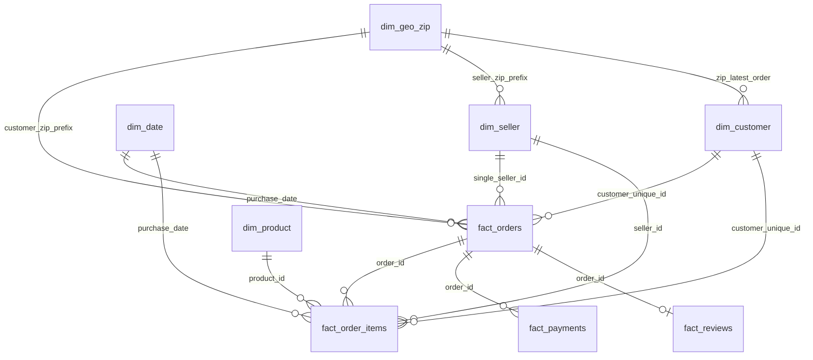

# 07 — Data Modeling (Star Schema)

> Pendamping `sql/07_data_modeling.sql`. Hasil dijalankan di DuckDB lokal.
> Modeling tidak mengubah populasi analitik; model hanya merepresentasikan dataset yang sudah Profiled → Cleaned → Validated → KPI Locked.

## Input
- Tabel clean Tahap 5: `orders_clean`, `order_items_clean`, `order_payments_clean`, `order_reviews_clean`, `products_clean`, `sellers_clean`, `dim_customer`, `dim_geo_zip`
- Definisi dan populasi terkunci: `docs/methodology.md`

## Proses Analisis
1. `dim_geo_zip`: tambah kolom `is_placeholder` dan baris placeholder untuk zip customer/seller yang tidak ada di geolocation.
2. Bangun `dim_seller`, `dim_product`, `dim_date` (dengan `period_quality`).
3. Bangun `fact_orders` (tabel anak di-pre-aggregate ke grain `order_id` sebelum join), `fact_order_items`, `fact_payments`, `fact_reviews`.
4. Validasi: row count, grain, key integrity, fan-out test, dan recompute populasi/KPI terkunci dari model.
5. Ekspor 9 file `data/processed/07_*.parquet`.

`dim_customer` dan `dim_geo_zip` sudah dibangun di Tahap 5 dengan grain yang sama; di sini keduanya divalidasi dan diekspor sebagai bagian dari model.

## Temuan

### Ringkasan validasi

**Gate PASS: 47 dari 47 rule HARD lolos (run pertama). Rule KPI: 17 dari 17 cocok setelah perbaikan `answered_before_delivery` (rerun).** Satu INFO: jumlah placeholder geo (162).

> Rerun kedua sempat menghasilkan 1 FAIL HARD (`dim_geo_zip` non-placeholder 19.177 vs 19.015, placeholder 0) karena pembangunan placeholder tidak idempotent: `ALTER TABLE ... ADD COLUMN IF NOT EXISTS` mereset flag `is_placeholder` pada baris yang sudah ada. Diperbaiki dengan membangun ulang `dim_geo_zip` dari baris asli (`n_points_dedup > 0`) ditambah placeholder (`n_points_dedup = 0`); aman dijalankan berulang. Konfirmasi hasil akhir menunggu rerun.

### Skema

### Tabel model

| Tabel | Grain | Baris | Kolom |
|---|---|---:|---:|
| `dim_customer` | 1 `customer_unique_id` | 96.096 | 13 |
| `dim_seller` | 1 `seller_id` | 3.095 | 6 |
| `dim_product` | 1 `product_id` | 32.951 | 12 |
| `dim_geo_zip` | 1 zip prefix | 19.177 | 8 |
| `dim_date` | 1 hari (2016-09-01 s.d. 2018-10-31) | 791 | 13 |
| `fact_orders` | 1 order | 99.441 | 42 |
| `fact_order_items` | 1 item (`order_id`, `order_item_id`) | 112.650 | 15 |
| `fact_payments` | 1 pembayaran (`order_id`, `payment_sequential`) | 103.886 | 9 |
| `fact_reviews` | 1 review per order (dedup D3) | 98.673 | 12 |

Row count parquet `07_*` sama dengan tabel di atas.

### Acceptance Criteria

| Kriteria | Hasil |
|---|---|
| `fact_orders` = Order Population | 99.441 ✔ |
| `fact_order_items` = Item Population | 112.650 ✔ |
| `fact_payments` | 103.886 ✔ |
| `fact_reviews` = order ber-review | 98.673 ✔ |
| Duplikat key di 9 tabel | 0 ✔ |
| Key integrity (13 FK) | 0 orphan ✔ |
| `SUM(price)` fact_order_items = stg | selisih 0 ✔ |
| `SUM(freight)` fact_order_items = stg | selisih 0 ✔ |
| `SUM(item_revenue)` fact_orders = `SUM(price)` fact_order_items | selisih 0 ✔ |
| `SUM(freight_total)` fact_orders = `SUM(freight)` fact_order_items | selisih 0 ✔ |
| `SUM(payment_total)` fact_orders = `SUM(payment_value)` fact_payments | selisih 0 ✔ |
| `SUM(n_items)` fact_orders = baris fact_order_items | selisih 0 ✔ |
| Baris `fact_orders` tetap setelah join agregat | 99.441 ✔ |
| Produk `unknown` ada di `dim_product`; `category_en_clean` NULL | 610 produk; 0 NULL ✔ |

### `dim_date` dan `period_quality`
Bulan: `missing` 1 (2016-11), `sparse_rampup` 3, `truncated` 2, `full` 20 (= Analysis Window). `period_quality = full` konsisten dengan `in_analysis_window` (0 baris beda); 0 order di bulan `missing`.

### `dim_geo_zip` placeholder
19.015 zip asli + **162 placeholder** (`is_placeholder = TRUE`, lat/lng NULL, kota `unknown`) untuk zip customer/seller yang tidak ada di geolocation, sehingga semua FK ke `dim_geo_zip` lolos tanpa orphan. Cakupan koordinat tidak berubah (279 baris customer dan 7 baris seller tetap tanpa koordinat). Jarak seller–customer memperlakukan placeholder sebagai tanpa koordinat.

### Recompute KPI terkunci dari model (semua cocok)

| KPI / populasi | Nilai dari model |
|---|---:|
| Item Revenue Revenue Population (fact_order_items dan fact_orders) | R$ 13.494.400,74 |
| Freight Revenue | R$ 2.241.126,29 |
| AOV | R$ 137,42 |
| Late Rate | 6,773% |
| Avg Review Score (fact_reviews dan fact_orders) | 4,0864 |
| Repeat Rate (≥24 jam) | 2,208% |
| Cancellation Rate | 0,629% |
| Payment Total | R$ 16.008.872,12 |
| Revenue Orders / Delivered / Review / Single-Seller / Analysis Window | 98.199 / 96.470 / 98.673 / 96.922 / 99.092 |
| Order tanpa item | 775 |

### `answered_before_delivery`
Run pertama menghasilkan **4.654** review `answered_before_delivery = TRUE`, sedangkan angka EDA untuk Delivered × Review adalah **4.653** (180 + 4.473). Flag di `fact_reviews` awalnya dihitung untuk semua order yang punya tanggal terima, sehingga ikut menghitung order di luar Delivered Population. Definisi diperbaiki: flag hanya terisi untuk `is_delivered_complete` dan NULL untuk order lain (konsisten dengan stratifikasi D4). Setelah perbaikan, hasilnya **4.653 (PASS)**. Ini perbaikan definisi flag, bukan perubahan KPI terkunci.

## Output
- Tabel: `dim_customer`, `dim_seller`, `dim_product`, `dim_geo_zip`, `dim_date`, `fact_orders`, `fact_order_items`, `fact_payments`, `fact_reviews`, `model_validation`
- `data/processed/07_*.parquet` (9 file; ter-ignore git)

## Assumptions
- Key = natural key (`customer_unique_id`, `seller_id`, `product_id`, zip prefix, tanggal); tidak ada surrogate key.
- Ukuran uang tetap `DECIMAL(12,2)`. Ukuran tanpa nilai bernilai NULL, bukan 0 (mis. `payment_total` order tanpa payment, `item_revenue` order tanpa item, `review_score` order tanpa review).
- Fakta membawa flag populasi (`is_revenue_order`, `in_analysis_window`) agar BI tidak menjumlahkan item dari order canceled/unavailable.
- `fact_orders` membawa `single_seller_id` dan `is_single_seller_pop` (D10) untuk atribusi ke satu seller tanpa ambigu.
- Teks komentar review tidak dibawa ke model (NLP di luar scope); `has_comment` cukup.
- `qty_units` berulang di tiap baris pasangan order-produk: jangan di-SUM; unit terjual = `COUNT(*)` baris item.
- `dim_geo_zip` placeholder memakai state hasil `MIN(state)` dari customer/seller untuk zip tersebut.

## Batasan data
- Pembangunan placeholder `dim_geo_zip` kini idempotent (dibangun ulang dari baris asli + placeholder pada setiap run).
- `fact_reviews` tidak mempunyai FK ke `dim_date`; tanggal review dihubungkan lewat `fact_orders.purchase_date`.
- Jarak seller–customer tidak tersedia untuk baris dengan zip placeholder atau tanpa koordinat valid (279 customer, 7 seller).
- Kota seller belum sepenuhnya bersih (lihat `docs/assumptions.md`); lokasi seller mengikuti `seller_state` (D8).
- Placeholder geo memakai satu state per zip; bila sebuah zip dipakai oleh customer di beberapa state, state ini hanya perkiraan.

## Kesimpulan
Model dimensional (5 dimensi, 4 fakta) selesai dan rekonsiliasi penuh terhadap Order Population dan Item Population: tanpa fan-out, tanpa orphan, dan seluruh KPI terkunci ter-recompute identik dari model. Satu selisih definisi flag (`answered_before_delivery`) sudah diperbaiki dan terkonfirmasi (4.653). Skema siap dipakai untuk Part 5 (Business Analysis); tidak ada perubahan grain yang belum final.
